# Vaistnav Kumar

> `AI Engineer · Voice AI · Full Stack Developer`  
> `Tirupati, India · Building AI Voice Agents & Healthcare SaaS`

  Every visual below is generated locally with Python, SVG, and GitHub Actions.

## 🌐 Connect with Me

  

  

  

  

## Contribution Heatmap

  

## ASCII Portrait + Info Card

<table>
  <tr>
    <td width="42%" valign="top">
      
    </td>
    <td width="58%" valign="top">
      
    </td>
  </tr>
</table>

## Terminal Dashboard

  

## Skills

  

## Timeline

  

## Footer

  

